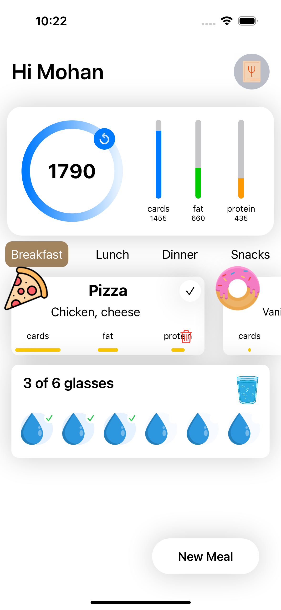
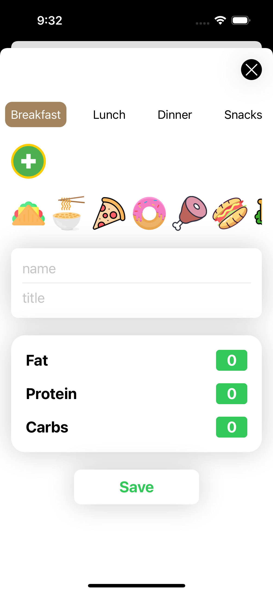
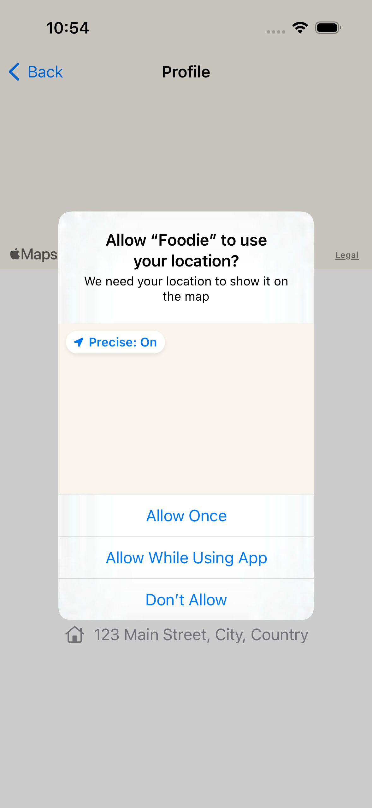
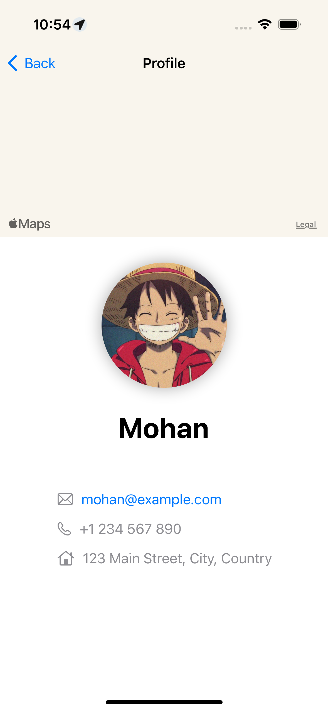

Please go under edit and edit this file as needed for your project.  There is no seperate documentation needed.

# Project Name - Foodie
# Student Id - IT20643522
# Student Name - Weerasinghe M.K.

#### 01. Brief Description of Project - 
The "Foodie" project is a SwiftUI application designed to help users track their daily caloric intake by allowing them to enter their meals, including custom entries. The app includes features for managing meals (Breakfast, Lunch, Dinner, and Snacks), tracking water intake, and displaying nutritional information through a user-friendly interface. The app leverages CoreData for persistent storage of meal data and integrates with the user's location to display personalized information.

#### 02. Users of the System - 
The primary users of this system are individuals who are health-conscious and interested in monitoring their daily caloric and nutritional intake. This can include:

 - Fitness enthusiasts
 - Individuals on a diet
 - People with specific dietary requirements
 - General users interested in maintaining a healthy lifestyle
   
#### 03. What is unique about your solution -

 - Intuitive Interface: The app provides a user-friendly and visually appealing interface with easy-to-use components for meal entry and tracking.
 - Custom Entries: Users can add custom meals with specific nutritional information.
 - Comprehensive Tracking: The app not only tracks calories but also macronutrients like proteins, fats, and carbohydrates.
 - CoreData Integration: Persistent storage ensures that users' data is retained across sessions.
 - Location Integration: Displays the user's location and integrates personalized data.
 - 
#### 04. Briefly document the functionality of the screens you have (Include screen shots of images)

1. Home Screen




Functionality:

 - Daily Caloric Intake Circle: Shows the current daily caloric intake using a circular progress bar.
 - Nutritional Bars: Displays bars for tracking the intake of carbohydrates, fats, and proteins.
 - Meal Cards: Shows meal cards for the selected meal type (e.g., Breakfast). Each card includes the meal name, ingredients, and nutritional values.
 - Water Intake Tracker: Displays the number of water glasses consumed out of the daily goal.

2. Add Meal Screen


   
Functionality:
 - Tab Navigation: Users can switch between different meal types (Breakfast, Lunch, Dinner, Snacks) using the tab navigation at the top.
 - Meal Icon Selection: Users can select an icon for the meal by tapping on the plus icon, which displays a horizontal scrollable list of food icons.
 - Meal Information Input: Users can enter the meal name and title in the provided text fields.
 - Nutritional Values Input: Users can input the nutritional values (Fat, Protein, Carbs) for the meal.

3. Location Permission Screen



Functionality:

 - Location Permission Request: Asks the user for permission to use their location for displaying on the map.
 - Options: Users can choose to allow location access once, while using the app, or deny access.

4. Profile Screen



Functionality:

 - Map View: Displays the user's current location on a map at the top of the screen.
 - Profile Image: Shows the user's profile image.
 - User Details: Displays the user's name, email, phone number, and address.


#### 05. Give examples of best practices used when writing code
e.g The code below uses consistant naming conventions for variables, uses structures and constants where ever possible. (Elaborate a bit more on what you did)

```

// Example of a CoreData Model Class with Proper Naming and Initialization
class MealDataModel: ObservableObject {
    let container: NSPersistentContainer
    @Published var savedMeals: [MealEntity] = []
    
    init() {
        container = NSPersistentContainer(name: "FoodieDataModel")
        container.loadPersistentStores { (description, error) in
            if let error = error {
                print("Error loading CoreData: \(error)")
            }
        }
        fetchData()
    }
    
    func fetchData() {
        let request = NSFetchRequest<MealEntity>(entityName: "MealEntity")
        do {
            savedMeals = try container.viewContext.fetch(request)
        } catch {
            print("Error fetching data: \(error)")
        }
    }
    
    func addMeal(name: String, type: String, calories: Float) {
        let newMeal = MealEntity(context: container.viewContext)
        newMeal.name = name
        newMeal.type = type
        newMeal.calories = calories
        saveData()
    }
    
    func saveData() {
        do {
            try container.viewContext.save()
            fetchData()
        } catch {
            print("Error saving data: \(error)")
        }
    }
}

// Example of a SwiftUI View using MVVM pattern
struct ContentView: View {
    @EnvironmentObject var mealDataModel: MealDataModel
    @State private var selectedTab: MealType = .breakfast
    
    var body: some View {
        NavigationView {
            VStack {
                // Proper use of VStack and HStack for layout
                HStack {
                    Text("Hi User").bold().font(.largeTitle)
                    Spacer()
                    Image(systemName: "person.crop.circle.fill")
                        .resizable()
                        .frame(width: 50, height: 50)
                }
                .padding()
                
                // Custom View for displaying meals
                MealListView(meals: mealDataModel.savedMeals)
                
                // Tab view for meal selection
                TabView(selection: $selectedTab) {
                    Text("Breakfast").tag(MealType.breakfast)
                    Text("Lunch").tag(MealType.lunch)
                    Text("Dinner").tag(MealType.dinner)
                    Text("Snacks").tag(MealType.snacks)
                }
                .frame(height: 50)
                .padding()
                
                Spacer()
                
                // Button for adding new meals
                Button(action: {
                    // Action for adding a new meal
                }) {
                    Text("Add Meal").bold()
                        .frame(width: 150, height: 50)
                        .background(Color.green)
                        .foregroundColor(.white)
                        .cornerRadius(10)
                }
                .padding()
            }
        }
    }
}

// Example of an Enum for Meal Types
enum MealType: String {
    case breakfast, lunch, dinner, snacks
}

// Custom View for Meal List
struct MealListView: View {
    var meals: [MealEntity]
    
    var body: some View {
        List {
            ForEach(meals) { meal in
                Text(meal.name ?? "Unknown Meal")
            }
        }
    }
}

// Example of a CoreData Entity Class
extension MealEntity: Identifiable {}

```

#### 06. UI Components used

 - NavigationView: For navigation and displaying the main content.
 - VStack/HStack: For arranging views vertically and horizontally.
 - Text: For displaying text.
 - Image: For displaying images.
 - Circle: For creating circular shapes.
 - ScrollView: For displaying scrollable content.
 - Button: For interactive elements.
 - Sheet: For presenting modal views.
 - Map: For displaying the user's location.

#### 07. Testing carried out

The following classes implemented unit testing for the ```AddBreakfastt```, ```AddBreakfastt``` and ```Addvalue```. 

```
    func testAddBreakfast() throws {
        viewModel.addBreakfast(icon: "taco", name: "Taco", ingredients: "Cheese, Meat", fat: 10, protein: 20, cards: 30)
        XCTAssertEqual(viewModel.saveBreakfastEntity.count, 1)
        let breakfast = viewModel.saveBreakfastEntity.first
        XCTAssertEqual(breakfast?.icon, "taco")
        XCTAssertEqual(breakfast?.name, "Taco")
        XCTAssertEqual(breakfast?.ingrediants, "Cheese, Meat")
        XCTAssertEqual(breakfast?.fat, 10)
        XCTAssertEqual(breakfast?.protein, 20)
        XCTAssertEqual(breakfast?.cards, 30)
    }

    func testAddLunch() throws {
        viewModel.addLunch(icon: "pizza", name: "Pizza", ingredients: "Cheese, Tomato", fat: 15, protein: 25, cards: 35)
        XCTAssertEqual(viewModel.saveLunchEntity.count, 1)
        let lunch = viewModel.saveLunchEntity.first
        XCTAssertEqual(lunch?.icon, "pizza")
        XCTAssertEqual(lunch?.name, "Pizza")
        XCTAssertEqual(lunch?.ingredients, "Cheese, Tomato")
        XCTAssertEqual(lunch?.fat, 15)
        XCTAssertEqual(lunch?.protein, 25)
        XCTAssertEqual(lunch?.cards, 35)
    }

    func testAddValue() throws {
        viewModel.addValue(fat: 5, protein: 10, cards: 15)
        let valueEntity = viewModel.saveValueEntity.first
        XCTAssertEqual(valueEntity?.fat, 5)
        XCTAssertEqual(valueEntity?.protein, 10)
        XCTAssertEqual(valueEntity?.cards, 15)
    }

The following classes implemented unit UI testing for the ```AddNewMeal```.

func testAddNewMeal() throws {
        // Tap the "New Meal" button to open AddView
        app.staticTexts["New Meal"].tap()
        
        // Fill in the meal details
        app.textFields["name"].tap()
        app.textFields["name"].typeText("Burger")
        
        app.textFields["title"].tap()
        app.textFields["title"].typeText("Beef, Lettuce")
        
        app.images["plus"].tap() // Assuming the icon selection is handled
        
        // Save the meal
        app.staticTexts["Save"].tap()
        
        // Verify that the meal is added (this part depends on your implementation)
        XCTAssertTrue(app.staticTexts["Burger"].exists)
    }

```

#### 08. Documentation 

(a) Design Choices

 - Navigation and Layout: A NavigationView is used to structure the app, with various content sections organized using VStack and HStack.
 - Custom Components: Custom views and modifiers are created to keep the code clean and reusable.
 - CoreData Integration: CoreData is chosen for persistent storage due to its seamless integration with Swift and powerful data handling capabilities.

(b) Implementation Decisions

 - Data Fetching: Data fetching is implemented in the CDDataModel class to keep the data handling logic separate from the UI.
 - Environment Object: cddatamodel is used as an EnvironmentObject to share data across different views.
 - Animation and User Feedback: Animations are used to enhance user interaction, such as toggling meal selection.
   
(c) Challenges

 - CoreData Management: Handling CoreData fetch requests and ensuring data consistency was a significant challenge.
 - UI/UX Design: Creating an intuitive and appealing interface that works well across different screen sizes required careful planning and testing.
 - Performance Optimization: Ensuring smooth performance while fetching and displaying data was critical, especially with potentially large datasets.
 - 
#### 09. Reflection

Challenges Faced :
 - CoreData Complexity: Managing CoreData entities and relationships was complex and required thorough testing to ensure data integrity.
 - SwiftUI Learning Curve: SwiftUI has a different paradigm compared to UIKit, and adapting to its reactive nature posed initial challenges.

  

